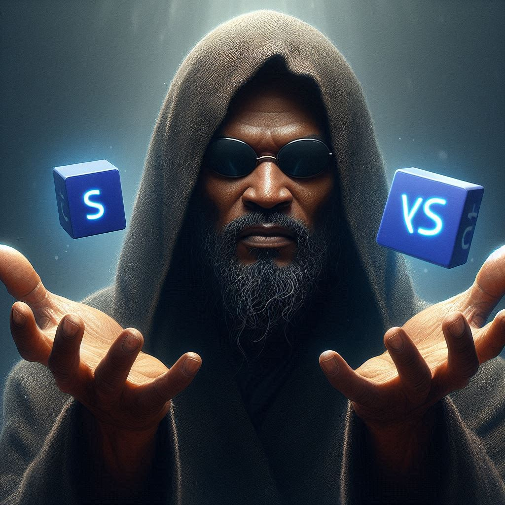
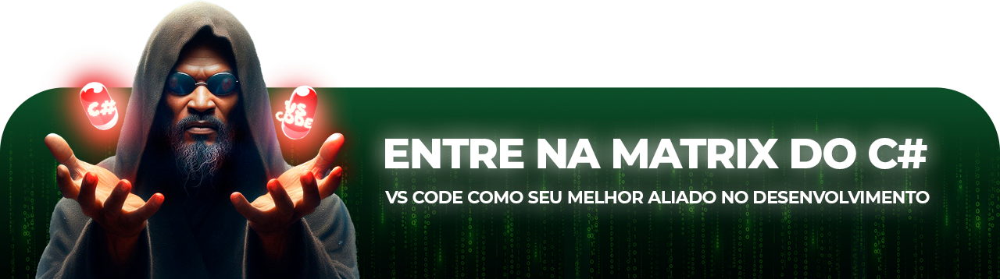
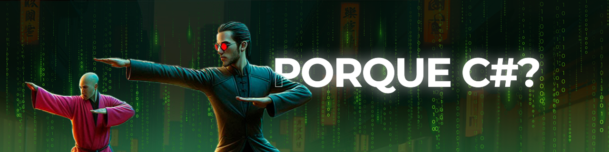
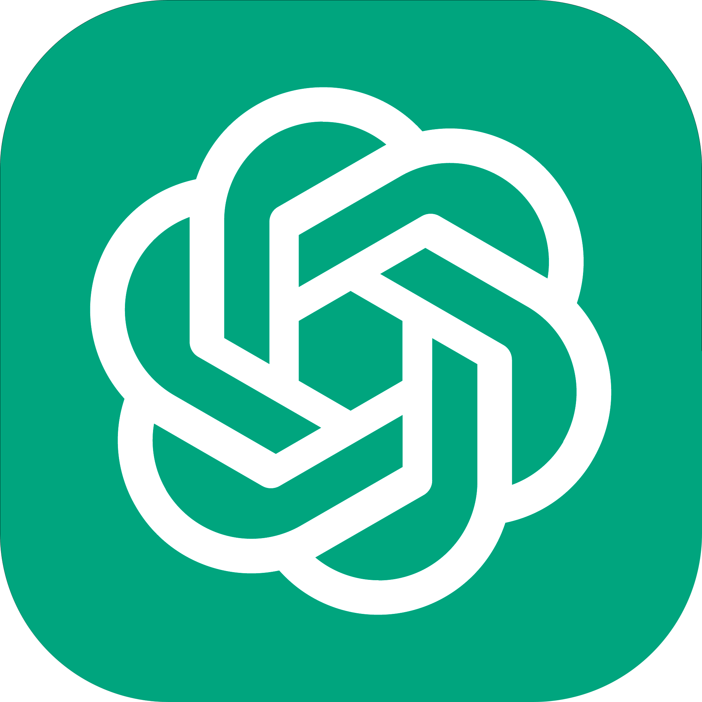
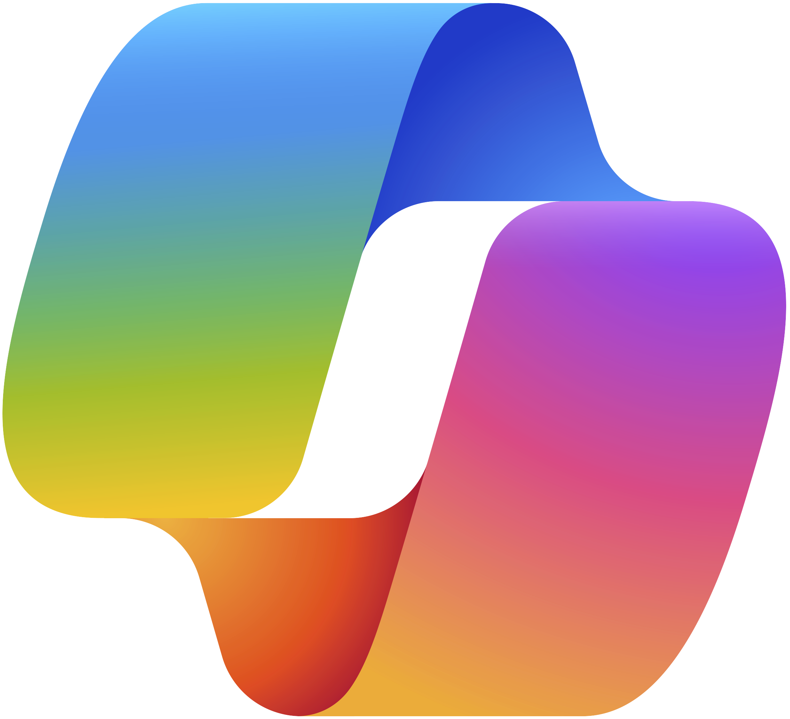
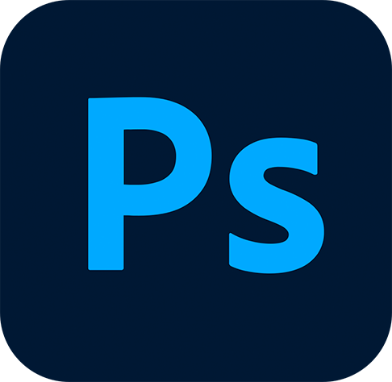
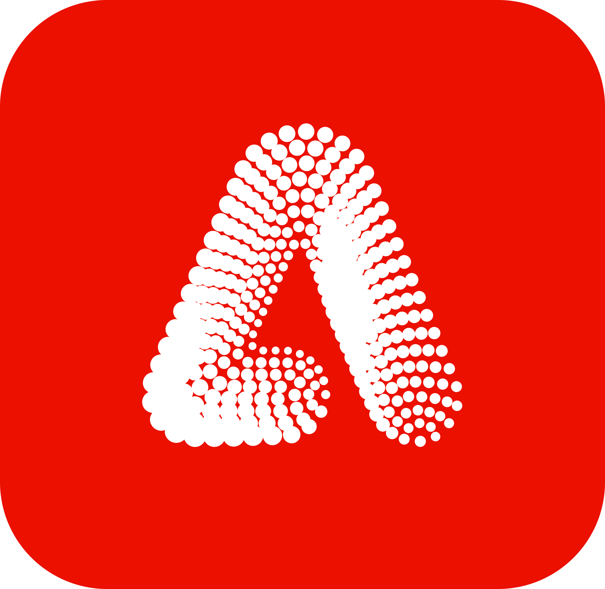
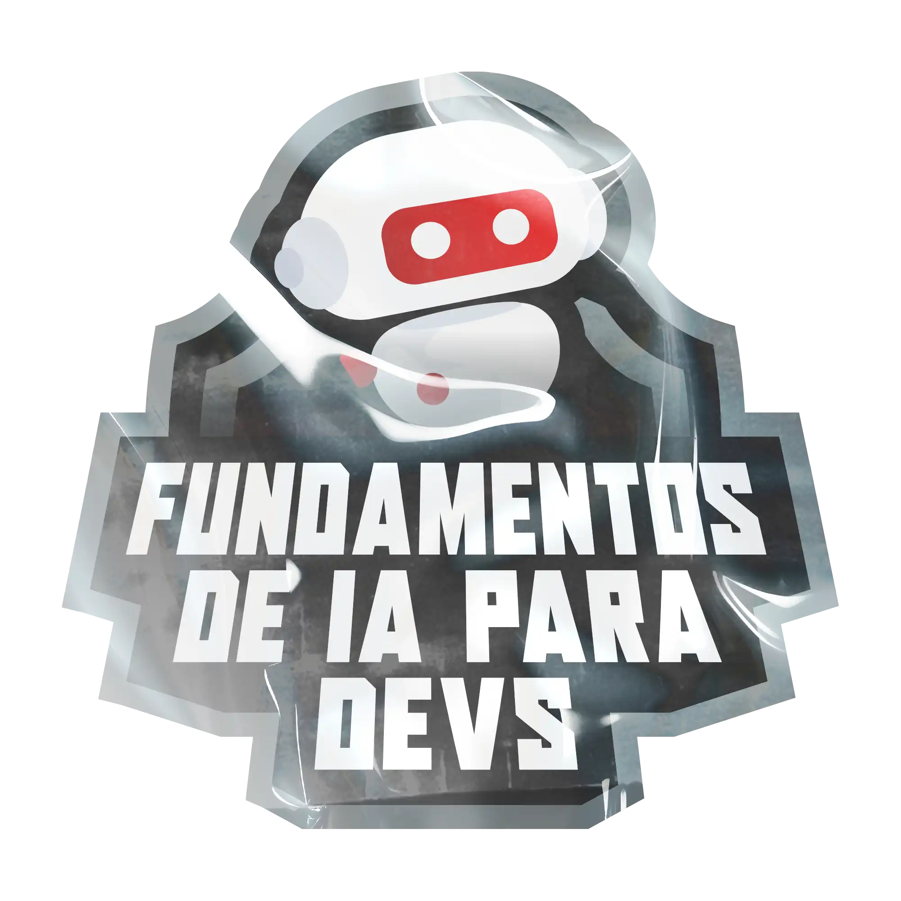

# Artigo feito com apoio de IA ✍️

## 📒 Descrição 
Esse artigo com **linguagem** de **fácil** entendimento e **Arts de Headline atrativas**, tem o objetivo de te mostrar os **benefícios** de utilizar **C#** juntamente com o **VSCode** com o **.NET**, usando **referências** incríveis do **Matrix**, tudo isso gerado por **chatGPT** e o recursos de imagens do **Copilot**, com os **prompts** e análise certa pode ter um **excelente resultado** 😉

## 👩‍💻 Alguns Prompts 
Onde tudo começa, a concepção da ideia:
### Escolha do tema 💡
```
me indique pelo menos 3 temas e estruturas, para eu desenvolver um artigo  sobre C#, VS Code e .NET 
```
### Construção do Artigo ✍️

```
Baseado no tema um 1, construa um artigo na seguinte estrutura:

Comporte-se como escritor de artigos tech fullstack e escreva o artigo atendendo 
as regras abaixo

{REGRAS}
>No máximo 5 linhas por bloco de explicação 

>Explique de maneira informal, como se fosse uma criança de 10 anos

>Os blocos que serão criados estão dentro do tema 1

>Utilize exemplos com referências do Filme Matrix

Ilustrações de capa: gerada por Copilot

Conteúdo gerado por: chatGPT e revisões humanas

```
<strong><a href="https://chatgpt.com/share/66f49bb8-61ec-8010-9210-582c2aa6bd77" target="_blank">Conversa completa com o chatGPT</a></strong> ⬅️

### Amostra de Prompt utilizado para criação de imagem no Copilot 🖼️
```
crie para mim uma imagem do personagem morpheus com as mãos estendidas com uma mão com o logo C# na mão e não outra o logo do VS Code, no estilo ultrarealista
```
#### Resultado - sem edição 🖌️🚫

<br>


# 🚩 Resultado Final




## Introdução

Imagina que você está na **Matrix**, com linhas de código caindo pela tela. O C# é como as habilidades que o Neo adquire para lutar contra os agentes — só que no mundo da programação. E ao invés de usar uma ferramenta pesada como o Visual Studio, você tem o VS Code, uma ferramenta leve e ágil, permitindo que você programe com a mesma leveza e destreza do Neo desviando de balas.

Se você é iniciante, este artigo vai te mostrar como essa dupla pode te transformar no "Escolhido" do mundo da programação.



O C# é uma linguagem versátil, assim como as habilidades do Neo na **Matrix**. Ela permite que você crie uma ampla gama de aplicações: desde jogos com Unity até grandes sistemas corporativos. Sua sintaxe clara e robusta facilita o aprendizado, tornando-a uma excelente escolha para iniciantes que querem mergulhar no universo do desenvolvimento de software. 

Se você está começando, o C# oferece uma curva de aprendizado suave, mas poderosa, como quando Neo começa a dominar as regras da **Matrix**. Com o tempo, você poderá construir sistemas complexos, da mesma forma que o Neo aprende a manipular as regras ao seu redor.


**CONTINUE O ARTIGO** [**AQUI...**](https://digitalinnovation.one/artigos/c-e-vs-code-um-ambiente-agil-para-desenvolvedores-iniciantes) 📕

## Ferramentas Utilizadas 🛠️
<div style="display: flex; gap: 5px">
    <a href="https://chatgpt.com/"></a>
    <a href="https://copilot.microsoft.com/"></a>
    <a href="https://www.adobe.com/br/products/photoshop.html"></a>
    <a href="https://www.adobe.com/br/products/firefly.html"></a>
</div>


## Um gostinho do Making off ☝️🤓


## 👨‍💻 Autora

<p>
    
    <p>&nbsp&nbsp&nbspAmanda Meneghini<br>
    &nbsp&nbsp&nbsp
    <a href="https://github.com/AmandaMeneghini" target="_blank">GitHub</a>&nbsp;|&nbsp;
    <a href="https://www.linkedin.com/in/amanda-meneghini/" target="_blank">LinkedIn</a>
    &nbsp;&nbsp;
    </p>
<br><br>


# Nota 📝



&nbsp;<p>Desafio proposto pelo professor [**Felipe Aguiar**](https://www.linkedin.com/in/felipeaguiar-exe/), no **Bootcamp Fundamentos de IA para Devs** da [**DIO**](https://www.dio.me/) em parceria com o [**Banco Santander**](https://www.linkedin.com/company/banco-santander/)</p>

 <br>

 **Obrigada** por 👀 até aqui 💛 by [Amanda Meneghini](https://github.com/AmandaMeneghini)